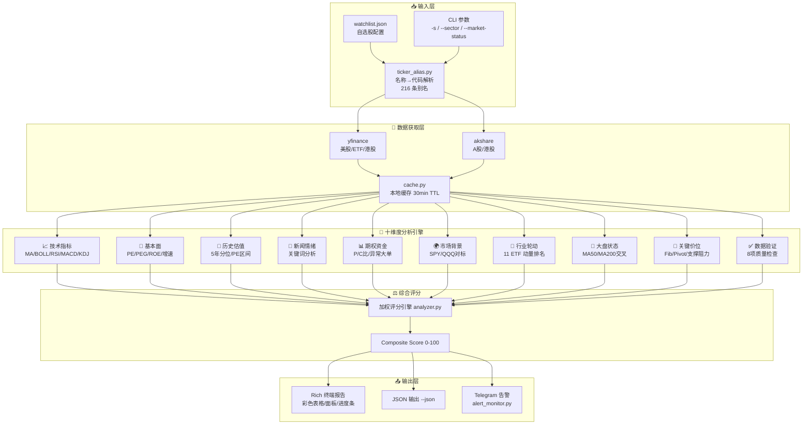
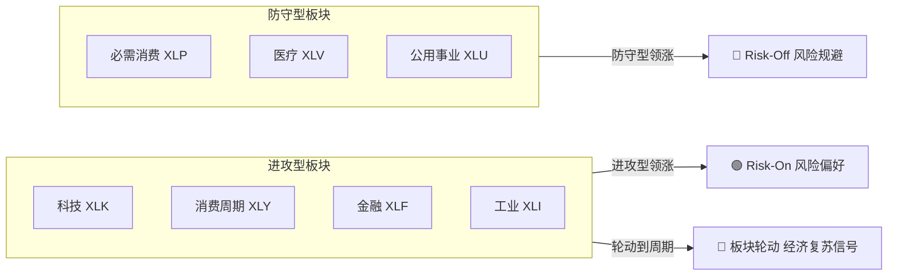
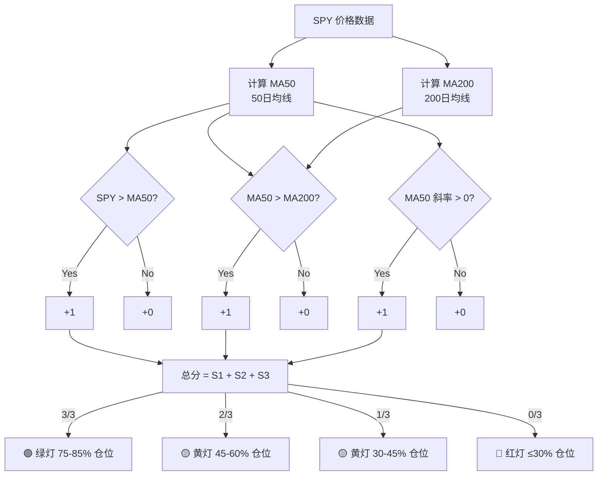
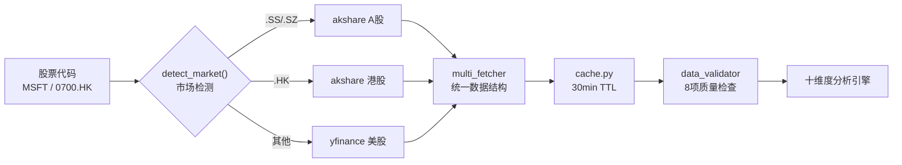

# 📊 股票多维技术分析系统

## 一句话说明

输入股票代码，自动拉取数据，输出 **十维度综合分析报告**——支撑阻力、买卖信号、估值分位、期权资金、新闻情绪、**行业轮动排名**、**大盘状态灯**，支持美股/A股/港股。

---

## 系统架构



## 多维评分模型

### 评分公式

系统采用**十维度加权评分模型**，综合技术面、基本面、情绪面、资金面进行量化评估：

$$
\text{Score} = \frac{\displaystyle\sum_{i=1}^{10} W_i \times S_i}{\displaystyle\sum_{i=1}^{10} W_i}
$$

其中 $W_i$ 为维度权重，$S_i$ 为维度原始分（0-100）。

各维度权重分配（基于实战经验调优）：

| 维度 | 权重 | 评分逻辑 |
|------|:----:|---------|
| 📈 技术趋势 | 20% | MA多头排列+20, MACD金叉+15, RSI超买-20 |
| 📉 技术信号 | 10% | 金叉死叉/背离检测 |
| 🏢 基本面 | 15% | PEG<1加分, ROE>15%加分, 增速>20%加分 |
| 📐 历史估值 | 10% | 5年价格分位: <30%加分, >70%扣分 |
| 📰 新闻情绪 | 8% | 正面关键词频率加权 |
| 📊 期权资金 | 7% | P/C比异常+大单净流入 |
| 🌍 市场背景 | 10% | 相对强弱: 个股 vs SPY/行业ETF |
| 🔄 行业轮动 | 8% | 所在板块动量排名加权 |
| 🚦 大盘状态 | 7% | 绿灯+10, 黄灯0, 红灯-15 |
| ✅ 数据可信度 | 5% | 8项验证通过比例 |

### 技术趋势评分子模型

```
技术趋势分 = 基础分(50)
           + MA排列修正     (多头排列+20 / 空头排列-20 / 纠缠0)
           + MACD修正       (金叉+15 / 死叉-15 / 零轴上+5)
           + RSI修正        (超买>70→-20 / 超卖<30→+15 / 中性0)
           + 布林修正       (突破上轨-10 / 跌破下轨+10)
           + KDJ修正        (金叉+10 / 死叉-10)
           + 量比修正       (放量突破+10 / 缩量下跌-5)

MA多头排列判定: price > MA5 > MA20 > MA60 > MA200
```

### 综合建议映射

| 评分区间 | 建议 | 操作策略 |
|:--------:|------|---------|
| 75-100 | 🟢 强烈买入 | 逢回调加仓，设好止损 |
| 60-74 | 🟢 偏多 | 持有/轻仓买入，关注阻力 |
| 45-59 | 🟡 中性 | 观望，等突破或回踩确认 |
| 30-44 | 🔴 偏空 | 减仓/不加仓，关注支撑 |
| 0-29 | 🔴 强烈卖出 | 止损离场，等趋势反转 |

## 行业轮动算法

### 多周期动量评分

$$
\text{Momentum} = 0.50 \times R_5 + 0.30 \times R_{20} + 0.20 \times R_{60}
$$

其中 $R_n$ 为 n 日涨幅在 11 个行业中的排名归一化分数（0-100）。

### 资金流向判断

系统通过**进攻型 vs 防守型**板块对比判断资金流向：



判断逻辑：

| 条件 | 信号 | 含义 |
|------|------|------|
| 进攻型前3占比 > 60% | 🟢 Risk-On | 积极做多，关注周期股 |
| 防守型前3占比 > 60% | 🔴 Risk-Off | 减仓防守，保留现金 |
| 进攻型排名↑ 且防守↓ | 🔄 轮动到周期 | 经济复苏预期 |
| 其他 | 🟡 中性 | 正常配置 |

## 大盘状态判定

### MA50/MA200 交叉信号



### 仓位建议模型

| 状态灯 | 建议仓位 | 操作策略 |
|:------:|:--------:|---------|
| 🟢 绿灯 | 75-85% | 逢回调加仓强势股，关注突破信号 |
| 🟡 黄灯 | 45-60% | 不加仓，持有等待，关注支撑/阻力 |
| 🔴 红灯 | ≤30% | 止损弱势股，保留现金等反转 |

## 数据获取流程



---

## 快速开始

### 1. 安装依赖

```bash
pip3 install yfinance pandas numpy rich scipy akshare --break-system-packages
```

> 如果报错，换成：`/opt/homebrew/bin/python3.12 -m pip install yfinance pandas numpy rich scipy akshare --break-system-packages`

### 2. 配置你的自选股

编辑 `watchlist.json`（项目根目录下，没有就运行 `python3.12 main.py --init-watchlist` 生成）：

```json
{
  "_说明": "以 _ 开头的字段是注释，不会被加载",
  "core_index": ["SPY", "QQQ", "IWM"],
  "mag7": ["MSFT", "AAPL", "NVDA", "GOOGL", "AMZN", "META", "TSLA"],
  "hk": ["0700.HK", "9988.HK"]
}
```

> 也支持纯文本 `watchlist.txt`（每行一个代码，`#` 开头为注释）

### 3. 运行分析

```bash
cd stock_monitor  # 进入项目目录

# 分析 watchlist.json 中的全部股票
python3.12 main.py

# 只分析指定股票
python3.12 main.py -s MSFT GOOGL AAPL

# 每60分钟自动刷新
python3.12 main.py -s MSFT --interval 60

# 🆕 行业轮动排名（看资金流向哪个板块）
python3.12 main.py --sector

# 🆕 大盘状态灯（现在是进攻还是防守）
python3.12 main.py --market-status

# 🆕 一键全跑（大盘状态 → 行业轮动 → 个股分析）
python3.12 main.py --all
```

---

## 📋 自选股配置详解

### 股票代码怎么查

| 市场 | 代码格式 | 怎么查 | 示例 |
|------|---------|--------|------|
| **美股** | 直接写代码 | 富途/雪球搜公司英文名，代码就是 Ticker | `MSFT`（微软）、`NVDA`（英伟达） |
| **A股上海** | 代码`.SS` | 6 开头 = 上海，加 `.SS` 后缀 | `600519.SS`（茅台）、`601318.SS`（平安） |
| **A股深圳** | 代码`.SZ` | 0/3 开头 = 深圳，加 `.SZ` 后缀 | `000858.SZ`（五粮液）、`300750.SZ`（宁德时代） |
| **港股** | 代码`.HK` | 加 `.HK` 后缀，不足4位补前导零 | `0700.HK`（腾讯）、`9988.HK`（阿里） |

### 常用代码速查

```
美股七巨头:
  AAPL  苹果          MSFT  微软          GOOGL 谷歌(Alphabet)
  AMZN  亚马逊        NVDA  英伟达        META  Meta(Facebook)
  TSLA  特斯拉

美股热门:
  NFLX  奈飞          AMD   超微半导体    CRM   Salesforce
  AVGO  博通          ORCL  甲骨文        JPM   摩根大通
  BRK.B 伯克希尔B     V     Visa          COST  好市多

指数/ETF:
  SPY   标普500 ETF   QQQ   纳指100 ETF   IWM   罗素2000 ETF
  DIA   道琼斯 ETF    ARKK  方舟创新 ETF  SOXX  半导体 ETF

行业 ETF（轮动观察用）:
  XLK   科技          XLF   金融          XLE   能源
  XLV   医疗          XLY   消费周期      XLP   必需消费
  XLI   工业          XLB   原材料        XLRE  房地产
  XLU   公用事业      XLC   通信服务

港股:
  0700.HK  腾讯       9988.HK  阿里       9888.HK  百度
  3690.HK  美团       1810.HK  小米       9618.HK  京东

A股:
  600519.SS  茅台     000858.SZ  五粮液   300750.SZ  宁德时代
  601318.SS  平安     002594.SZ  比亚迪   600036.SS  招商银行
```

### 添加/删除股票

打开 `watchlist.json`，直接编辑即可：

```json
{
  "_说明": "自选股配置 — 改完直接跑 python3.12 main.py",
  "my_stocks": ["MSFT", "NVDA", "TSLA"],
  "watching": ["AAPL", "META"],
  "hk": ["0700.HK"]
}
```

**规则：**
- 分组名随意取（`my_stocks`、`watching`、`hk` 都行）
- 以 `_` 开头的字段是注释，不加载
- 代码不区分大小写（`msft` = `MSFT`）
- 自动去重
- 支持纯文本格式 `watchlist.txt`（一行一个代码，`#` 注释）

### 用命令行临时分析

不想改文件？直接 `-s` 指定：

```bash
python3.12 main.py -s MSFT NVDA TSLA
```

### 指定另一个配置文件

```bash
python3.12 main.py --watchlist ~/my_other_list.json
```

---

## 🔄 行业轮动排名

看资金在往哪个板块流，判断当前该买什么行业。

```bash
python3.12 main.py --sector
```

输出内容：
- 11 个行业 ETF 按 5日/20日/60日 涨幅排名
- 资金流向判断：风险偏好 / 风险规避 / 板块轮动 / 中性
- 领涨 vs 领跌板块
- 操作建议

**怎么看：**
- 领涨板块 = 资金正在流入，可以关注该板块内的强势个股
- 领跌板块 = 资金正在流出，回避
- 如果科技(XLK)领涨 + 必需消费(XLP)领跌 = 进攻信号
- 如果公用事业(XLU)领涨 + 科技(XLK)领跌 = 防守信号

---

## 🚦 大盘状态灯

告诉你现在该进攻还是防守。

```bash
python3.12 main.py --market-status
```

| 灯 | 含义 | 建议仓位 | 操作 |
|----|------|---------|------|
| 🟢 绿灯 | SPY > MA50 > MA200，趋势向上 | 75-85% | 积极做多，逢回调加仓 |
| 🟡 黄灯 | 均线纠缠或部分条件不满足 | 45-60% | 正常配置，不加仓 |
| 🔴 红灯 | SPY < MA50 < MA200，趋势向下 | 30% | 减仓防守，保留现金 |

输出内容：
- SPY/QQQ 详细数据（价格、均线、斜率、波动率、回撤）
- MA50/MA200 金叉/死叉状态
- 建议仓位百分比
- 操作清单

---

## 命令速查

```bash
# === 个股分析 ===
python3.12 main.py                         # 分析 watchlist.json 全部
python3.12 main.py -s MSFT                 # 单只股票
python3.12 main.py -s MSFT NVDA GOOGL      # 多只股票
python3.12 main.py -s MSFT --json          # JSON 输出
python3.12 main.py -s MSFT --interval 60   # 每60分钟刷新
python3.12 main.py --local -s MSFT         # 离线测试（不联网）

# === 🆕 宏观分析 ===
python3.12 main.py --sector                # 行业轮动排名
python3.12 main.py --market-status         # 大盘状态灯
python3.12 main.py --all                   # 全部跑一遍

# === 🆕 配置管理 ===
python3.12 main.py --init-watchlist        # 生成示例 watchlist.json
python3.12 main.py --watchlist mylist.json # 指定配置文件
```

---

## 报告解读

### 数据交叉验证卡（每份报告最顶部）

跑完报告后，打开富途牛牛，对比这 5 个字段：

| 字段 | 系统值 | 富途值 |
|------|--------|--------|
| 数据日期 | 2026-08-03 | 看日K最后一天 |
| 收盘价 | $373.51 | 看日K收盘价 |
| 实时价 | $373.51 | 看实时报价 |
| 货币 | USD | 确认币种 |
| 市场状态 | PRE/POST/REGULAR | 盘前/盘后/交易中 |

**5 项都吻合 = 数据正确。不吻合 = 看红色告警。**

### 综合判断

```
██████████████████░░  ← 可视化评分条
评分: 92/100          ← 0-100，越高越好
建议: 🟢 强烈买入     ← 5 档: 强烈买入/偏多/中性/偏空/强烈卖出
趋势: 震荡偏多         ← 三重确认: 价格vs均线 + 均线斜率 + MACD
```

### 关键价位（最重要）

```
现价: $373.51
阻力1: $376.00 (前高，+0.7%)    ← 突破这个才能涨
阻力2: $386.31 (Fib，+3.4%)
支撑1: $372.66 (Fib，-0.2%)     ← 跌破这个要警惕
支撑2: $361.63 (Fib，-3.2%)
支撑3: $355.00 (期权最大痛点，-5.0%)

📈 上涨场景: 突破$376 → 目标$386 → $400
📉 下跌场景: 跌破$373 → 支撑$362 → 再跌到$355
🎲 风险收益比: 1.1:1 (一般，谨慎操作)
```

### 十维度覆盖

| 维度 | 数据来源 | 内容 |
|------|---------|------|
| 📈 技术指标 | 计算得出 | RSI/MACD/KDJ/布林/均线/量比/K线形态 |
| 🏢 基本面 | yfinance | PE/PEG/营收增速/利润率/ROE/分析师评级 |
| 📐 历史估值 | yfinance | 5年价格分位/PE区间/偏离MA200 |
| 📰 新闻情绪 | yfinance+Google RSS | 关键词分析，判断市场情绪方向 |
| 📊 期权资金 | yfinance | P/C比/异常大单/最大痛点 |
| 🌍 市场背景 | yfinance | SPY/QQQ/行业ETF对比，相对强弱 |
| 🔄 行业轮动 | yfinance | 11个行业ETF排名+资金流向判断 |
| 🚦 大盘状态 | yfinance | SPY/QQQ均线交叉+仓位建议 |

### 底部核验清单

每份报告底部有 5 步核验清单，确保数据可信后再看分析结论。

---

## 数据源

| 市场 | 数据源 | 需要注册？ |
|------|--------|:---:|
| 美股 | yfinance (Yahoo Finance) | ❌ |
| A股 | akshare (新浪/东方财富) | ❌ |
| 港股 | akshare (新浪/腾讯) | ❌ |

---

## 推荐工作流

每天开盘前/收盘后跑一次：

```bash
# 1. 看大盘环境 — 现在是绿灯还是红灯？
python3.12 main.py --market-status

# 2. 看行业轮动 — 资金在流向哪个板块？
python3.12 main.py --sector

# 3. 分析你的持仓 — watchlist.json 里的股票全部跑一遍
python3.12 main.py
```

或者偷懒一条命令搞定：

```bash
python3.12 main.py --all
```

---

## 常见问题

### Q: 报错 "Too Many Requests. Rate limited"

Yahoo 暂时封了你的 IP（短时间请求太多）。等 15 分钟再跑，或者用 `--local` 模式先测试逻辑：

```bash
python3.12 main.py --local -s MSFT
```

### Q: 数据跟富途对不上

看报告顶部的「数据交叉验证卡」和底部「核验清单」。可能原因：
- 数据未结算（Yahoo 延迟），系统会自动用实时价回填
- 盘后/盘前时段，显示的是实时价而非收盘价
- Yahoo 数据源与富途有微小偏差（正常）

### Q: A股/港股怎么加

| 市场 | 格式 | 示例 |
|------|------|------|
| A股上海 | 代码`.SS` | `600519.SS`（茅台）、`601318.SS`（平安） |
| A股深圳 | 代码`.SZ` | `000858.SZ`（五粮液）、`300750.SZ`（宁德时代） |
| 港股 | 代码`.HK` | `0700.HK`（腾讯）、`9988.HK`（阿里） |

### Q: 不知道某只股票的代码怎么办

1. **富途/雪球** — 搜索公司名，详情页显示 Ticker/代码
2. **Google** — 搜 `"公司名 stock ticker"`，如 `"英伟达 stock ticker"` → NVDA
3. **Yahoo Finance** — [finance.yahoo.com](https://finance.yahoo.com) 搜索
4. **直接试** — 美股一般就是公司缩写（Apple=AAPL, Microsoft=MSFT, NVIDIA=NVDA）

### Q: 技术指标参数怎么调

编辑 `config.py` 中的参数，比如把 RSI 周期从 14 改成 9：

```python
RSI_PERIOD = 9
```

### Q: watchlist.json 和 config.py 的 SYMBOLS 什么关系

优先级：`watchlist.json` > `watchlist.txt` > `config.py SYMBOLS`

- 有 `watchlist.json` 就用它（推荐）
- 没有就找 `watchlist.txt`
- 都没有才用 `config.py` 里的 `SYMBOLS` 列表
- `config.py` 里的指标参数（均线周期、RSI 等）仍然生效

---

## 免责声明

本系统仅供学习研究使用，**不构成任何投资建议**。

- 数据来自第三方免费 API，不保证 100% 准确
- 技术分析基于历史数据，不预测未来
- 投资有风险，入市需谨慎

---

## 文件结构

```
stock_monitor/
├── main.py              ← 入口（命令行解析 + 流程编排）
├── watchlist.json       ← ⭐ 自选股配置（改这里加减股票，不上传 git）
├── watchlist.example.json ← 📝 watchlist 示例模板
├── watchlist_loader.py  ← 自选股加载器（JSON/TXT + 名称解析）
├── ticker_alias.py      ← 🆕 名称→代码别名解析（216 条）
├── sector_rotation.py   ← 🆕 行业轮动排名（11个ETF + 资金流向）
├── market_status.py     ← 🆕 大盘状态灯（均线交叉 + 仓位建议）
├── config.py            ← 指标参数（均线/RSI/MACD/KDJ/评分权重）
├── indicators.py        ← MA/BOLL/RSI/MACD/KDJ 计算
├── signals.py           ← 信号检测（金叉死叉/背离）
├── patterns.py          ← K线形态识别
├── analyzer.py          ← 综合评分引擎（十维度加权）
├── report.py            ← Rich 终端报告渲染
├── levels.py            ← 支撑/阻力/Fibonacci/场景推演
├── fundamentals.py      ← 美股基本面（PE/PEG/ROE）
├── fundamentals_cn.py   ← A股/港股基本面
├── sentiment.py         ← 新闻情绪分析
├── options_flow.py      ← 期权资金流（P/C比/异常大单）
├── market_context.py    ← 大盘/行业对标（相对强弱）
├── valuation_history.py ← 历史估值分位（5年价格分位）
├── data_validator.py    ← 数据健康检查（8项验证）
├── multi_fetcher.py     ← 多数据源获取（yfinance+akshare）
├── cache.py             ← 本地缓存（30min TTL）
├── local_data.py        ← 离线测试数据
├── alert_config.py      ← 告警规则配置
├── alert_monitor.py     ← Telegram 告警推送
├── LICENSE              ← MIT License
└── README.md            ← 本文件
```
