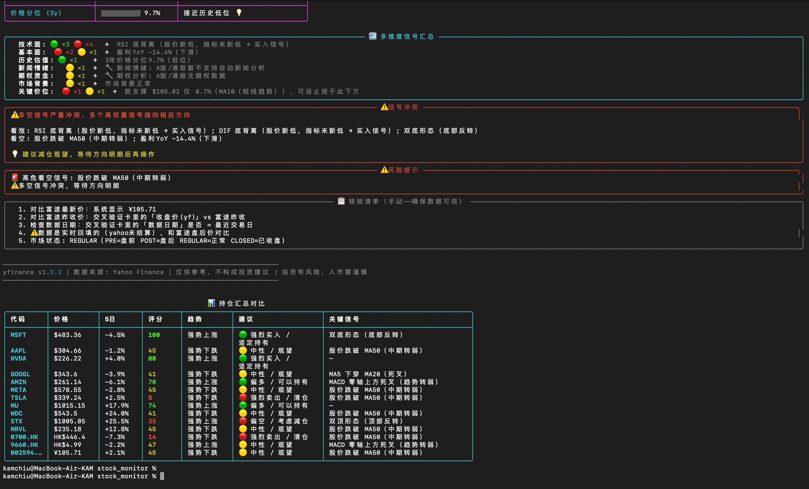
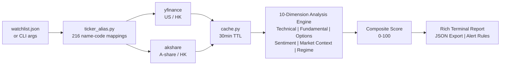
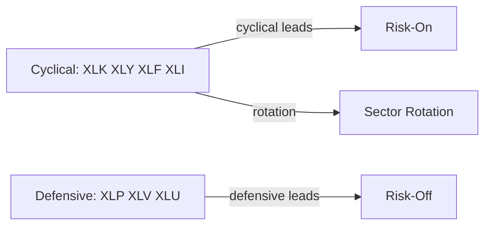
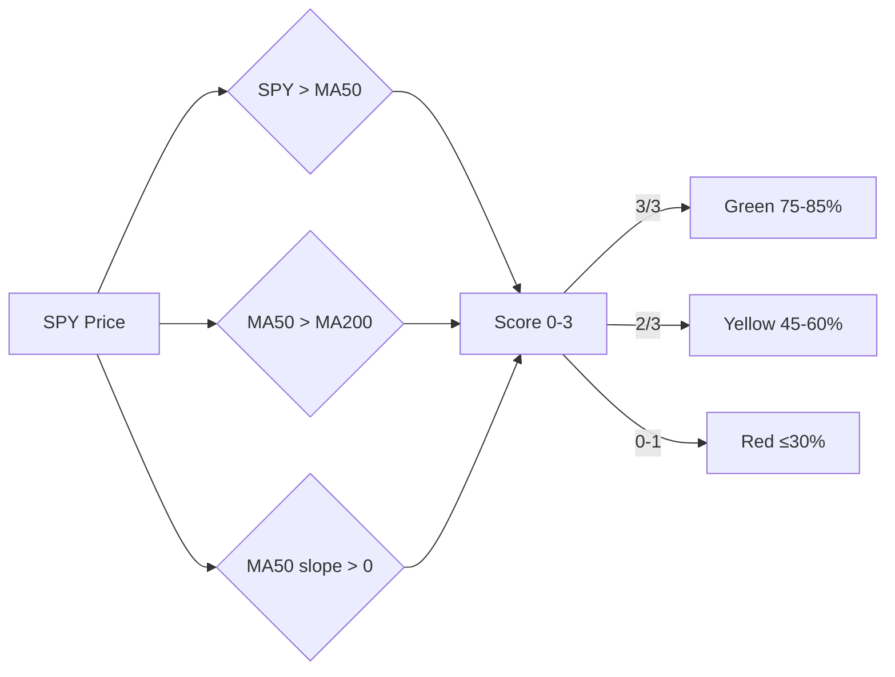
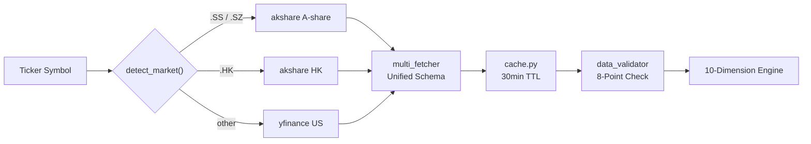

# 📈 Stock Monitor — Multi-Dimension Technical Analysis System

[](LICENSE)
[](https://www.python.org/)
[](https://github.com/Guojc-source/Stock_Monitor)

**English** | [简体中文](README_zh.md)

Quantitative analysis engine for **US / A-share / HK equity markets**. Integrates 10 analytical dimensions including technical indicators, fundamental valuation, options flow, news sentiment, sector rotation, and market regime detection. Outputs structured scoring reports with support/resistance levels, signal conflict analysis, and position sizing recommendations.

**No API keys. No database. Zero config** — Python 3.10+ with yfinance + akshare.

## 📸 Screenshots



*One run: per-stock 10-dimension reports (data validation card, signal conflict warnings, risk alerts, manual checklist) plus a cross-market portfolio summary table.*

## Highlights

- 🌏 **Three markets in one engine** — US stocks via yfinance, A-shares & HK stocks via akshare, market auto-detected from ticker format
- 🔟 **10-dimension composite scoring** — technicals, fundamentals, historical valuation percentile, news sentiment, options flow, market context, sector rotation, market regime, data quality
- 🚦 **Market regime traffic light** — SPY/QQQ MA50/MA200 state machine → green / yellow / red position guidance
- 🔄 **Sector rotation radar** — multi-period momentum ranking across 11 SPDR sector ETFs + risk-on / risk-off capital flow detection
- 🀄 **Type stock names in plain Chinese or English** — `"茅台"`, `"Tencent"`, `"Microsoft"` all resolve to tickers (216 built-in aliases)
- 📊 **Rich terminal reports** — data validation card, key support/resistance levels, signal conflict warnings; JSON output for scripting

---

## Architecture



## Scoring Model

### Composite Score

Weighted multi-factor model across technical, fundamental, sentiment, and capital flow dimensions:

$$
\text{Score} = \frac{\displaystyle\sum_{i=1}^{10} W_i \times S_i}{\displaystyle\sum_{i=1}^{10} W_i}
$$

Where $W_i$ = dimension weight, $S_i$ = raw score (0–100).

| Dimension | Weight | Scoring Logic |
|-----------|:------:|---------------|
| Technical Trend | 20% | MA alignment +20, MACD golden cross +15, RSI overbought -20 |
| Technical Signals | 10% | Golden/death cross, divergence detection |
| Fundamentals | 15% | PEG<1, ROE>15%, revenue growth>20% |
| Historical Valuation | 10% | 5Y price percentile: <30% bullish, >70% bearish |
| News Sentiment | 8% | Positive keyword frequency weighting |
| Options Flow | 7% | P/C ratio anomaly + large order net inflow |
| Market Context | 10% | Relative strength: stock vs SPY/sector ETF |
| Sector Rotation | 8% | Sector momentum ranking weight |
| Market Regime | 7% | Green +10, Yellow 0, Red -15 |
| Data Quality | 5% | 8-point validation pass rate |

### Technical Trend Sub-Model

```
Trend Score = Base(50)
  + MA alignment   (bullish +20 / bearish -20 / neutral 0)
  + MACD signal    (golden cross +15 / death cross -15 / above zero +5)
  + RSI            (overbought >70 → -20 / oversold <30 → +15)
  + Bollinger      (upper band break -10 / lower band break +10)
  + KDJ            (golden cross +10 / death cross -10)
  + Volume ratio   (breakout on volume +10 / decline on low vol -5)

Bullish alignment: price > MA5 > MA20 > MA60 > MA200
```

### Signal-to-Action Mapping

| Score Range | Signal | Strategy |
|:-----------:|--------|----------|
| 75–100 | Strong Buy | Accumulate on pullbacks, set stop-loss |
| 60–74 | Bullish | Hold / light buy, monitor resistance |
| 45–59 | Neutral | Wait for breakout or pullback confirmation |
| 30–44 | Bearish | Reduce exposure, monitor support |
| 0–29 | Strong Sell | Exit positions, wait for reversal |

## Sector Rotation Algorithm

### Multi-Period Momentum Scoring

$$
\text{Momentum} = 0.50 \times R_5 + 0.30 \times R_{20} + 0.20 \times R_{60}
$$

$R_n$ = rank-normalized n-day return across 11 SPDR sector ETFs (0–100).

### Capital Flow Detection



| Condition | Signal | Interpretation |
|-----------|--------|----------------|
| Cyclical top-3 share > 60% | Risk-On | Aggressive positioning, favor cyclicals |
| Defensive top-3 share > 60% | Risk-Off | Reduce exposure, preserve capital |
| Cyclical rank up + defensive down | Rotation | Economic recovery expectation |
| Mixed | Neutral | Standard allocation |

## Market Regime Detection

### MA50/MA200 Crossover State Machine



| Regime | Position | Strategy |
|:------:|:--------:|----------|
| Green | 75–85% | Accumulate on pullbacks, favor momentum leaders |
| Yellow | 45–60% | Hold current positions, no new additions |
| Red | ≤30% | Cut weak positions, preserve cash |

## Data Pipeline



---

## Quick Start

### Install

```bash
pip3 install yfinance pandas numpy rich scipy akshare
```

### Configure Watchlist

Create `watchlist.json` in the project root (or run `python3 main.py --init-watchlist`):

```json
{
  "_note": "Fields starting with _ are metadata, not loaded",
  "core_index": ["SPY", "QQQ", "IWM"],
  "mag7": ["MSFT", "AAPL", "NVDA", "GOOGL", "AMZN", "META", "TSLA"],
  "hk": ["0700.HK", "9988.HK"]
}
```

Supports ticker symbols and names in Chinese / English (auto-resolved via `ticker_alias.py`).

Plain text format also supported: `watchlist.txt` — one symbol per line, `#` for comments.

### Run

```bash
python3 main.py                         # all stocks in watchlist.json
python3 main.py -s MSFT GOOGL AAPL      # specific stocks
python3 main.py -s MSFT --json          # JSON output
python3 main.py -s MSFT --interval 60   # refresh every 60 min
python3 main.py --sector                # sector rotation ranking
python3 main.py --market-status         # market regime indicator
python3 main.py --all                   # full analysis pipeline
```

---

## Ticker Symbol Format

| Market | Format | Example |
|--------|--------|---------|
| US | Ticker symbol | `MSFT`, `AAPL`, `NVDA` |
| A-share (Shanghai) | Code + `.SS` | `600519.SS` (Moutai), `601318.SS` (Ping An) |
| A-share (Shenzhen) | Code + `.SZ` | `000858.SZ` (Wuliangye), `300750.SZ` (CATL) |
| Hong Kong | Code + `.HK` | `0700.HK` (Tencent), `9988.HK` (Alibaba) |

### Name Resolution

The system supports mixed input of ticker codes and company names (Chinese / English):

```json
{
  "my_stocks": ["MSFT", "微软", "Tencent", "0700.HK", "茅台"]
}
```

All names are resolved to standard ticker symbols before analysis. Alias dictionary covers 216 entries across US mega-caps, HK blue chips, A-share leaders, and major ETFs.

### Common Tickers Reference

```
US Mega-Caps:
  AAPL  Apple           MSFT  Microsoft       GOOGL Alphabet
  AMZN  Amazon          NVDA  NVIDIA          META  Meta
  TSLA  Tesla

US Notable:
  NFLX  Netflix         AMD   AMD             CRM   Salesforce
  AVGO  Broadcom        ORCL  Oracle          JPM   JPMorgan
  BRK.B Berkshire       V     Visa            COST  Costco

Index / ETF:
  SPY   S&P 500         QQQ   Nasdaq 100      IWM   Russell 2000
  DIA   Dow Jones       ARKK  ARK Innovation  SOXX  Semiconductors

Sector ETFs (rotation tracking):
  XLK   Technology      XLF   Financials      XLE   Energy
  XLV   Healthcare      XLY   Cons. Disc.     XLP   Cons. Staples
  XLI   Industrials     XLB   Materials       XLRE  Real Estate
  XLU   Utilities       XLC   Comm. Services

Hong Kong:
  0700.HK  Tencent      9988.HK  Alibaba      9888.HK  Baidu
  3690.HK  Meituan      1810.HK  Xiaomi       9618.HK  JD.com

A-Share:
  600519.SS  Moutai     000858.SZ  Wuliangye  300750.SZ  CATL
  601318.SS  Ping An    002594.SZ  BYD        600036.SS  CMB
```

---

## Report Structure

### Data Validation Card

Displayed at the top of every report. Cross-verify these 5 fields against your broker:

| Field | Description |
|-------|-------------|
| Data Date | Last trading day of fetched data |
| Close Price | Settlement price from data source |
| Live Price | Real-time quote (may differ during pre/post market) |
| Currency | USD / HKD / CNY |
| Market State | PRE / POST / REGULAR |

### Composite Score

```
██████████████████░░   Visual score bar
Score: 92/100          0-100, higher = more bullish
Signal: Strong Buy     5 levels: Strong Buy / Bullish / Neutral / Bearish / Strong Sell
Trend:  Bullish        Triple confirmation: price vs MA + MA slope + MACD
```

### Key Levels

```
Current:  $373.51
R1:       $376.00 (previous high, +0.7%)
R2:       $386.31 (Fibonacci, +3.4%)
S1:       $372.66 (Fibonacci, -0.2%)
S2:       $361.63 (Fibonacci, -3.2%)
S3:       $355.00 (options max pain, -5.0%)

Upside:   break $376 → target $386 → $400
Downside: break $373 → support $362 → $355
R/R:      1.1:1
```

---

## Recommended Workflow

```bash
# 1. Check market regime — green, yellow, or red?
python3 main.py --market-status

# 2. Check sector rotation — where is capital flowing?
python3 main.py --sector

# 3. Analyze your watchlist
python3 main.py

# Or run the full pipeline in one command:
python3 main.py --all
```

## Data Sources

| Market | Source | API Key Required |
|--------|--------|:----------------:|
| US | yfinance (Yahoo Finance) | No |
| A-share | akshare (Sina / East Money) | No |
| Hong Kong | akshare (Sina / Tencent) | No |

---

## Project Structure

```
stock_monitor/
├── main.py                # Entry point, CLI argument parsing
├── config.py              # Indicator parameters, scoring weights
├── watchlist.json         # Watchlist configuration (gitignored)
├── watchlist.example.json # Watchlist template
├── watchlist_loader.py    # Watchlist loader (JSON/TXT + alias resolution)
├── ticker_alias.py        # Name-to-ticker resolution (216 aliases)
├── sector_rotation.py     # Sector rotation: 11 SPDR ETFs + capital flow
├── market_status.py       # Market regime: MA50/MA200 crossover detection
├── analyzer.py            # Composite scoring engine (10 dimensions)
├── indicators.py          # MA / BOLL / RSI / MACD / KDJ computation
├── signals.py             # Signal detection (cross / divergence)
├── patterns.py            # Candlestick pattern recognition
├── report.py              # Rich terminal report rendering
├── levels.py              # Support / resistance / Fibonacci / scenarios
├── fundamentals.py        # US equity fundamentals (PE/PEG/ROE)
├── fundamentals_cn.py     # A-share / HK fundamentals
├── sentiment.py           # News sentiment analysis
├── options_flow.py        # Options flow (P/C ratio, unusual activity)
├── market_context.py      # Benchmark comparison, relative strength
├── valuation_history.py   # Historical valuation percentile
├── data_validator.py      # Data quality checks (8-point)
├── multi_fetcher.py       # Multi-source data dispatcher
├── data_fetcher.py        # Raw data fetching with retry logic
├── cache.py               # Local file cache (30min TTL)
├── local_data.py          # Offline test data
├── alert_config.py        # Alert rule configuration
├── LICENSE                # MIT License
└── README.md              # This file
```

## Troubleshooting

**"Too Many Requests"** — Yahoo Finance rate limit. Wait 15 minutes and retry, or use `--local` for offline testing.

**Data mismatch with broker** — Check the Data Validation Card at report top. Common causes: unsettled data (Yahoo delay), pre/post market live price backfill, minor source variance.

**Custom indicator parameters** — Edit `config.py` directly (e.g., `RSI_PERIOD = 9`).

---

## License

MIT License. See [LICENSE](LICENSE).

## Disclaimer

This system is for educational and research purposes only. It does not constitute investment advice. Data is sourced from third-party free APIs and may not be 100% accurate. Past performance does not guarantee future results. Invest at your own risk.

---

## Star History

[](https://star-history.com/#Guojc-source/Stock_Monitor&Date)

If Stock Monitor helps your analysis, consider giving it a ⭐ — it helps more people find this project.
