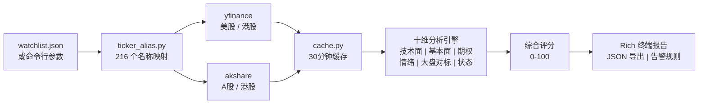
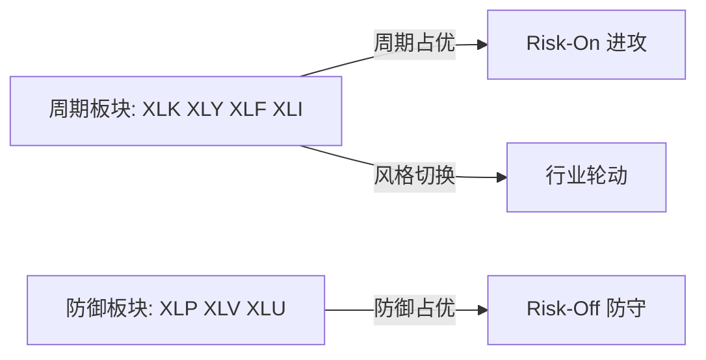
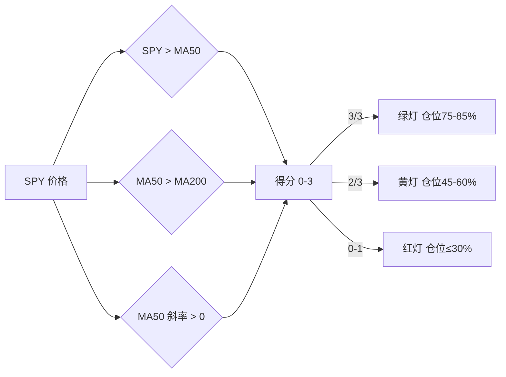
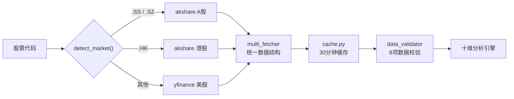

# 📈 Stock Monitor — 多维股票技术分析系统

[](LICENSE)
[](https://www.python.org/)
[](https://github.com/Guojc-source/Stock_Monitor)

[English](README.md) | **简体中文**

面向 **美股 / A股 / 港股** 三大市场的量化分析引擎。融合技术面、基本面、历史估值分位、新闻情绪、期权资金流、行业轮动、大盘状态等 **10 个分析维度**,输出结构化评分报告,包含支撑/阻力关键价位、多空信号冲突分析和仓位建议。

**无需 API Key,无需数据库,开箱即用** —— 基于 Python 3.10+ 与 yfinance + akshare。

## 📸 运行截图


*一次运行：个股十维报告（数据交叉验证卡、信号冲突警告、风险提示、核验清单）+ 跨市场持仓汇总对比表。*

> 💡 这个系统是「风险过滤器」,不是「买卖决策机器」。

## ✨ 核心亮点

- 🌏 **三市场一体** —— 美股走 yfinance,A股/港股走 akshare,按代码格式自动识别市场,无需手动配置
- 🔟 **十维综合评分** —— 技术面、基本面、估值分位、新闻情绪、期权资金流、大盘对标、行业轮动、大盘状态、数据质量
- 🚦 **大盘红绿灯** —— 基于 SPY/QQQ 的 MA50/MA200 状态机,输出绿/黄/红三档仓位建议
- 🔄 **行业轮动雷达** —— 11 个 SPDR 行业 ETF 多周期动量排名 + 风险偏好(Risk-On/Off)资金流向判断
- 🀄 **中英文名直接输入** —— `"茅台"`、`"腾讯"`、`"Microsoft"` 都能自动解析成股票代码(内置 216 个别名)
- 📊 **精美终端报告** —— 数据交叉验证卡、关键价位推演、信号冲突预警;支持 JSON 输出供程序调用

---

## 系统架构



## 评分模型

### 综合评分

跨技术面、基本面、情绪、资金流的多因子加权模型:

$$
\text{Score} = \frac{\displaystyle\sum_{i=1}^{10} W_i \times S_i}{\displaystyle\sum_{i=1}^{10} W_i}
$$

其中 $W_i$ 为维度权重,$S_i$ 为各维度原始得分(0–100)。

| 维度 | 权重 | 评分逻辑 |
|------|:----:|----------|
| 技术趋势 | 20% | 均线多头排列 +20,MACD 金叉 +15,RSI 超买 -20 |
| 技术信号 | 10% | 金叉/死叉、顶底背离检测 |
| 基本面 | 15% | PEG<1、ROE>15%、营收增速>20% |
| 历史估值分位 | 10% | 5 年价格分位:<30% 偏多,>70% 偏空 |
| 新闻情绪 | 8% | 正面关键词频率加权 |
| 期权资金流 | 7% | P/C 比率异常 + 大单净流入 |
| 大盘对标 | 10% | 相对强度:个股 vs SPY/行业 ETF |
| 行业轮动 | 8% | 行业动量排名加权 |
| 大盘状态 | 7% | 绿灯 +10,黄灯 0,红灯 -15 |
| 数据质量 | 5% | 8 项校验通过率 |

### 技术趋势子模型

```
趋势得分 = 基础分(50)
  + 均线排列   (多头 +20 / 空头 -20 / 中性 0)
  + MACD 信号  (金叉 +15 / 死叉 -15 / 零轴上方 +5)
  + RSI        (超买 >70 → -20 / 超卖 <30 → +15)
  + 布林带     (突破上轨 -10 / 跌破下轨 +10)
  + KDJ        (金叉 +10 / 死叉 -10)
  + 量能配合   (放量突破 +10 / 缩量阴跌 -5)

多头排列: 价格 > MA5 > MA20 > MA60 > MA200
```

### 评分 → 操作建议映射

| 分数区间 | 信号 | 操作策略 |
|:-------:|------|----------|
| 75–100 | 强烈买入 | 回调分批介入,严格设置止损 |
| 60–74 | 偏多 | 持有 / 轻仓试买,关注压力位 |
| 45–59 | 中性 | 观望,等待突破或回踩确认 |
| 30–44 | 偏空 | 减仓,关注支撑位 |
| 0–29 | 强烈卖出 | 清仓离场,等待反转信号 |

## 行业轮动算法

### 多周期动量评分

$$
\text{Momentum} = 0.50 \times R_5 + 0.30 \times R_{20} + 0.20 \times R_{60}
$$

$R_n$ = 11 个 SPDR 行业 ETF 的 n 日涨幅排名归一化得分(0–100)。

### 资金流向判断



| 条件 | 信号 | 解读 |
|------|------|------|
| 周期板块前 3 占比 > 60% | Risk-On | 资金进攻,可积极参与周期股 |
| 防御板块前 3 占比 > 60% | Risk-Off | 资金避险,降低仓位保存实力 |
| 周期排名上升 + 防御下降 | 轮动 | 经济复苏预期 |
| 混合 | 中性 | 常规配置 |

## 大盘状态灯

### MA50/MA200 交叉状态机



| 状态 | 建议仓位 | 操作策略 |
|:----:|:-------:|----------|
| 🟢 绿灯 | 75–85% | 回调加仓,聚焦动量龙头 |
| 🟡 黄灯 | 45–60% | 维持现有持仓,不加仓 |
| 🔴 红灯 | ≤30% | 砍掉弱势持仓,保留现金 |

## 数据流水线



---

## 快速开始

### 安装依赖

```bash
pip3 install yfinance pandas numpy rich scipy akshare
```

### 配置自选股

在项目根目录创建 `watchlist.json`(或运行 `python3 main.py --init-watchlist` 自动生成):

```json
{
  "_说明": "以 _ 开头的字段是注释,不会被加载",
  "core_index": ["SPY", "QQQ", "IWM"],
  "mag7": ["MSFT", "AAPL", "NVDA", "GOOGL", "AMZN", "META", "TSLA"],
  "hk": ["0700.HK", "9988.HK"]
}
```

支持股票代码与中英文名称混输(由 `ticker_alias.py` 自动解析)。

也支持纯文本格式 `watchlist.txt`:每行一个代码,`#` 开头为注释。

### 运行

```bash
python3 main.py                         # 分析 watchlist.json 中全部股票
python3 main.py -s MSFT GOOGL AAPL      # 只分析指定股票
python3 main.py -s MSFT --json          # JSON 输出
python3 main.py -s MSFT --interval 60   # 每 60 分钟自动刷新
python3 main.py --sector                # 行业轮动排名
python3 main.py --market-status         # 大盘状态灯
python3 main.py --all                   # 一键全量分析
```

---

## 股票代码格式

| 市场 | 格式 | 示例 |
|------|------|------|
| 美股 | 直接写代码 | `MSFT`, `NVDA`, `AAPL` |
| A股(上海) | 代码 + `.SS` | `600519.SS` (茅台), `601318.SS` (平安) |
| A股(深圳) | 代码 + `.SZ` | `000858.SZ` (五粮液), `300750.SZ` (宁德) |
| 港股 | 代码 + `.HK` | `0700.HK` (腾讯), `9988.HK` (阿里) |

### 名称解析

支持代码与公司名称混合输入(中文/英文均可):

```json
{
  "my_stocks": ["MSFT", "微软", "Tencent", "0700.HK", "茅台"]
}
```

所有名称在分析前都会被解析为标准股票代码。别名库覆盖美股巨头、港股蓝筹、A股龙头和主流 ETF,共 216 条。

### 常用代码速查

```
美股巨头:
  AAPL  苹果          MSFT  微软          GOOGL Alphabet
  AMZN  亚马逊        NVDA  英伟达        META  Meta
  TSLA  特斯拉

美股其他:
  NFLX  奈飞          AMD   AMD           CRM   Salesforce
  AVGO  博通          ORCL  甲骨文        JPM   摩根大通
  BRK.B 伯克希尔      V     Visa          COST  好市多

指数 / ETF:
  SPY   标普500       QQQ   纳指100       IWM   罗素2000
  DIA   道琼斯        ARKK  ARK创新       SOXX  半导体

行业 ETF(轮动跟踪):
  XLK   科技          XLF   金融          XLE   能源
  XLV   医疗          XLY   可选消费      XLP   必需消费
  XLI   工业          XLB   材料          XLRE  房地产
  XLU   公用事业      XLC   通信服务

港股:
  0700.HK  腾讯       9988.HK  阿里巴巴   9888.HK  百度
  3690.HK  美团       1810.HK  小米       9618.HK  京东

A股:
  600519.SS  贵州茅台  000858.SZ  五粮液  300750.SZ  宁德时代
  601318.SS  中国平安  002594.SZ  比亚迪  600036.SS  招商银行
```

---

## 报告结构

### 数据交叉验证卡

每份报告顶部展示。以下 5 个字段建议与你的券商软件交叉核对:

| 字段 | 说明 |
|------|------|
| 数据日期 | 拉取数据的最后交易日 |
| 收盘价 | 数据源结算价 |
| 实时价 | 实时报价(盘前/盘后可能与收盘价不同) |
| 货币 | USD / HKD / CNY |
| 市场状态 | 盘前 / 盘后 / 盘中 |

### 综合评分

```
██████████████████░░   可视化评分条
Score: 92/100          0-100,越高越偏多
Signal: 强烈买入        5 档:强烈买入/偏多/中性/偏空/强烈卖出
Trend:  多头           三重确认:价格 vs 均线 + 均线斜率 + MACD
```

### 关键价位

```
Current:  $373.51
R1:       $376.00 (前高, +0.7%)
R2:       $386.31 (斐波那契, +3.4%)
S1:       $372.66 (斐波那契, -0.2%)
S2:       $361.63 (斐波那契, -3.2%)
S3:       $355.00 (期权最大痛点, -5.0%)

Upside:   突破 $376 → 目标 $386 → $400
Downside: 跌破 $373 → 支撑 $362 → $355
R/R:      1.1:1
```

---

## 推荐工作流

```bash
# 1. 先看大盘状态 —— 绿灯、黄灯还是红灯?
python3 main.py --market-status

# 2. 再看行业轮动 —— 资金在流向哪里?
python3 main.py --sector

# 3. 分析你的自选股
python3 main.py

# 或者一条命令跑完全部:
python3 main.py --all
```

## 数据源

| 市场 | 数据源 | 需要 API Key |
|------|--------|:----:|
| 美股 | yfinance (Yahoo Finance) | 否 |
| A股 | akshare (新浪 / 东方财富) | 否 |
| 港股 | akshare (新浪 / 腾讯) | 否 |

---

## 项目结构

```
stock_monitor/
├── main.py                # 入口,命令行解析
├── config.py              # 指标参数、评分权重
├── watchlist.json         # 自选股配置(已 gitignore)
├── watchlist.example.json # 自选股模板
├── watchlist_loader.py    # 自选股加载器(JSON/TXT + 别名解析)
├── ticker_alias.py        # 名称→代码解析(216 个别名)
├── sector_rotation.py     # 行业轮动:11 个 SPDR ETF + 资金流向
├── market_status.py       # 大盘状态:MA50/MA200 交叉检测
├── analyzer.py            # 综合评分引擎(10 维度)
├── indicators.py          # MA / BOLL / RSI / MACD / KDJ 计算
├── signals.py             # 信号检测(金叉死叉 / 背离)
├── patterns.py            # K线形态识别
├── report.py              # Rich 终端报告渲染
├── levels.py              # 支撑 / 阻力 / 斐波那契 / 情景推演
├── fundamentals.py        # 美股基本面 (PE/PEG/ROE)
├── fundamentals_cn.py     # A股 / 港股基本面
├── sentiment.py           # 新闻情绪分析
├── options_flow.py        # 期权资金流 (P/C 比率、异常活动)
├── market_context.py      # 大盘对标、相对强度
├── valuation_history.py   # 历史估值分位
├── data_validator.py      # 数据质量校验(8 项)
├── multi_fetcher.py       # 多数据源分发器
├── data_fetcher.py        # 原始数据拉取(含重试)
├── cache.py               # 本地文件缓存(30分钟 TTL)
├── local_data.py          # 离线测试数据
├── alert_config.py        # 告警规则配置
├── LICENSE                # MIT 许可证
└── README.md              # 项目文档
```

## 常见问题

**"Too Many Requests"** —— Yahoo Finance 频率限制。等 15 分钟重试,或用 `--local` 离线模式测试。

**数据与券商软件对不上** —— 查看报告顶部的数据交叉验证卡。常见原因:未结算数据(Yahoo 有 T+1 延迟)、盘前/盘后实时价回填、数据源之间的微小差异。

**自定义指标参数** —— 直接编辑 `config.py`(例如 `RSI_PERIOD = 9`)。

**A股/港股数据** —— 由 akshare 提供,免费无需注册。单只股票拉取失败不影响其他标的分析。

---

## 许可证

MIT License,详见 [LICENSE](LICENSE)。

## 免责声明

本系统仅供学习和研究使用,不构成任何投资建议。数据来自第三方免费 API,不保证 100% 准确。历史表现不代表未来收益,投资有风险,入市需谨慎。

---

## Star History

[](https://star-history.com/#Guojc-source/Stock_Monitor&Date)

如果 Stock Monitor 对你的分析有帮助,欢迎点个 ⭐,让更多人发现这个项目。
